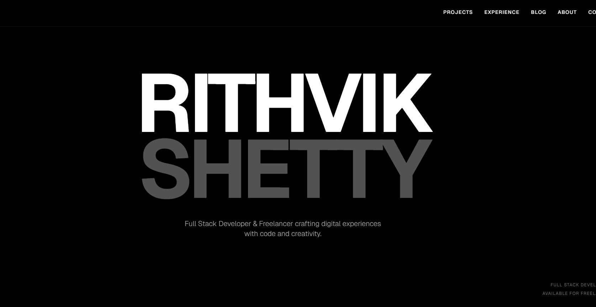

# Rithvik Shetty | Portfolio

A high-performance, immersive personal portfolio built at the intersection of full-stack engineering and interactive UI/UX design. This website showcases a bento-style bio, an animated experience timeline, filtered project sections, and a custom-built blog.



## 🚀 Built With

- **Framework**: [Next.js](https://nextjs.org/) (App Router)
- **Language**: [TypeScript](https://www.typescriptlang.org/)
- **Styling**: [Tailwind CSS](https://tailwindcss.com/)
- **Animations**: [Framer Motion](https://www.framer.com/motion/)
- **Icons**: [Lucide React](https://lucide.dev/)
- **Deployment**: [Vercel](https://vercel.com/)
- **Design**: [Figma](https://www.figma.com/)

## ✨ Key Features

- **Interactive Bento Grid**: A responsive and visually striking about section.
- **Dynamic Experience Timeline**: A toggleable journey timeline separated into industry roles and leadership positions.
- **Project Showcase**: Curated sections for both personal/research initiatives and client-focused projects.
- **Custom Blog & Achievements**: High-impact sections for sharing insights and historical milestones.
- **Accessibility & Performance**: Dark-mode-first aesthetic with optimized performance and high-contrast accessibility support.

## 🛠️ Getting Started

### Prerequisites

- Node.js (Latest LTS version)
- npm or yarn

### Installation

1.  **Clone the repository**:
    ```bash
    git clone https://github.com/rithvikshettyy/rithvikshetty.git
    ```
2.  **Install dependencies**:
    ```bash
    npm install
    # or
    yarn install
    ```
3.  **Run the development server**:
    ```bash
    npm run dev
    # or
    yarn dev
    ```
4.  **Build for production**:
    ```bash
    npm run build
    ```

## 📈 Status

This portfolio is continuously evolving. I am currently focusing on:
- Integrating specialized AI-driven project showcases.
- Enhancing the 3D interaction models and parallax backgrounds.
- Optimizing for high-resolution displays and large format screens.

## ✉️ Contact

- **Website**: [rithvikshetty.com](https://tinyroomconcert.vercel.app/) (Demo Link)
- **LinkedIn**: [Rithvik Shetty](https://www.linkedin.com/in/rithvikshetty/)
- **Email**: [Contact Page](public/contact)

---

Developed by [Rithvik Shetty](https://github.com/rithvikshettyy)
